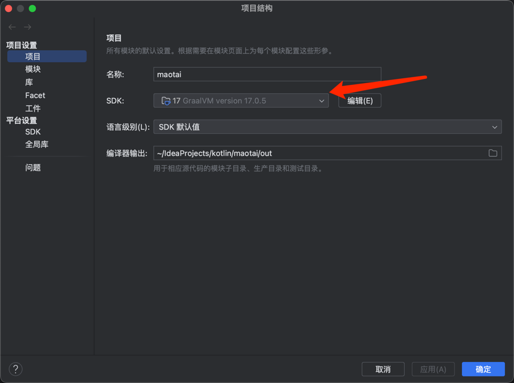
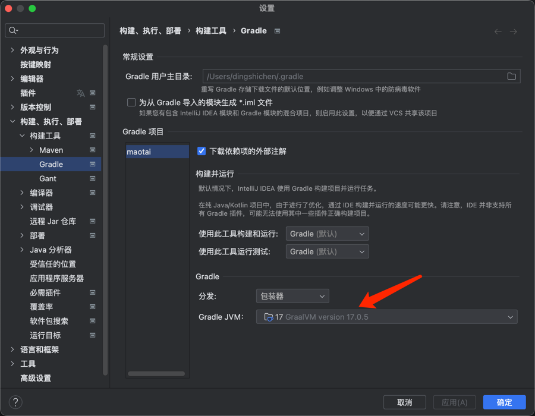
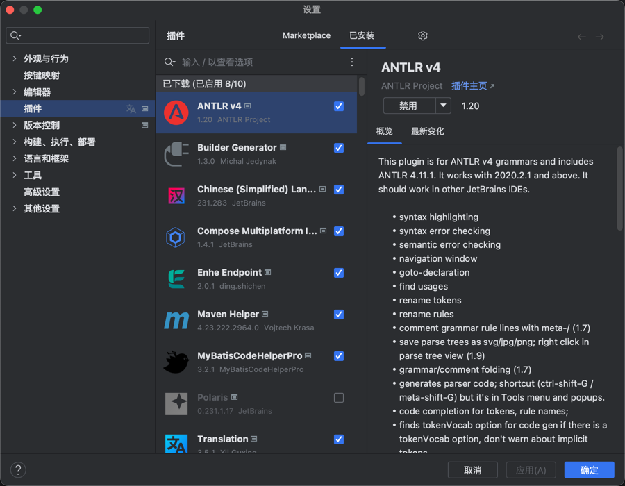
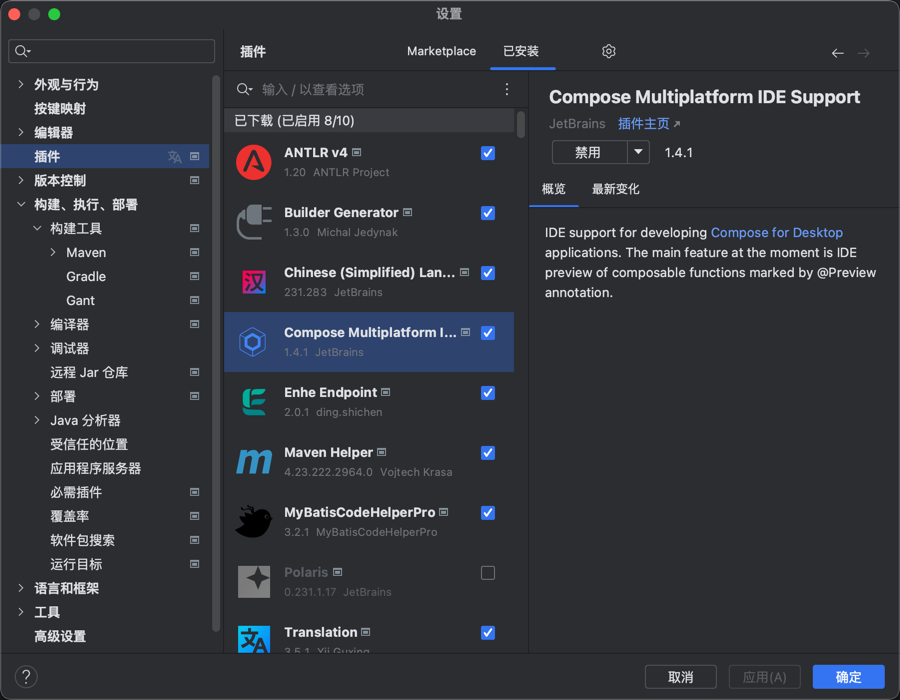

# Maotai

## 1 环境
### 1.1 `Project JDK` 设置为 `17`

### 1.2 `Gradle JDK` 设置为 `17`

### 1.3 如果需要预览 SQL 语法树，可以安装 IDEA [ANTLR v4](https://plugins.jetbrains.com/plugin/7358-antlr-v4) 插件

### 1.4 如果需要预览 `compose` 组件，可以安装 IDEA [compose](https://plugins.jetbrains.com/plugin/index?xmlId=org.jetbrains.compose.desktop.ide&utm_source=product&utm_medium=link&utm_campaign=IU&utm_content=2023.1) 插件

## 2 模块
- `core` SQL 处理的核心逻辑
- `desktop` 客户端界面

### 2.1 `core` 模块包目录
- `generate` 脚本生成
- `lang` 第三方语法解析
- `model` 模型 & 数据结构
- `parser` 抽象、简化的解析适配
- `type` 数据类型

### 2.2 `core` 模块开发
- 参考 `com.enhe.sql.MySQLTransferTest` 单元测试
- 运行测试读取脚本请修改 `com.enhe.sql.util.ScriptReader` 的读取目录
- 使用 ANTLR 插件调试：打开左侧工具栏的 `ANTLR Preview` 窗口，然后鼠标选中 `src/test/resources/MySQL/lang/MySqlParser.g4` 文件，即可在工具窗口左侧写入 SQL，右侧会展示出他的语法树
- 主要的解析语法的逻辑在 `lang.mysql.visitor` 包下
- 整体运行逻辑是 SQLTransfer 转换器入口 -> SQLParseAdapter 解析适配 -> LangParserVisitor 目标语法解析 -> Model 抽象出模型 -> Generate 生成新的脚本 -> Script 脚本

### 2.3 `desktop` 模块开发
- 语言 [kotlin](https://kotlinlang.org/)
- 框架 [compose-multiplatform](https://www.jetbrains.com/zh-cn/lp/compose-multiplatform/)